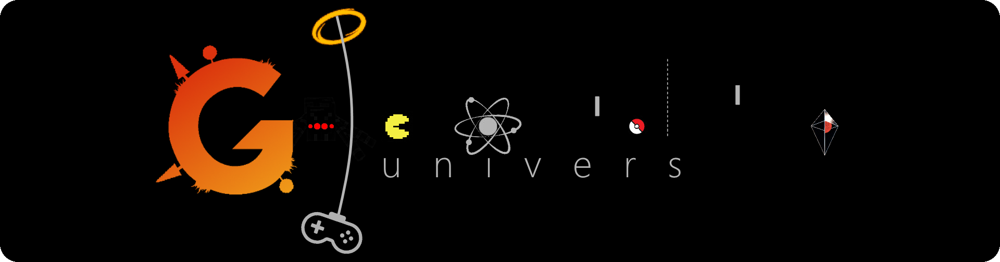

 [Gunivers](https://gunivers.net) is a community which aims to bridge the gap between learning and entertainment, all through creative, 100% free and open-source projects. The community is managed by [Altearn](https://altearn.xyz), a non-profit educative association created in 2020.

# Active community projects

 [Scaffolding Rush](https://github.com/Gunivers/Scaffolding-Rush) : A minecraft PvP Bedwar map based on scaffolding mecanics

 [Dispenser Project](https://github.com/theogiraudet/Dispenser-API) : A minecraft content delivery tool for developers and website managers
  - [Dispenser API](https://github.com/theogiraudet/Dispenser-API)
  - [Block Renderer](https://github.com/theogiraudet/Minecraft-Block-Renderer)

 [G-lib project](https://github.com/Gunivers/Glib) : A minecraft modular library datapack including plenty of tools for datapacker and mapmakers
  - [G-lib](https://github.com/Gunivers/Glib)
  - [G-lib Manager](https://github.com/Gunivers/Glib-Manager)

 Gunibot : A discord application focused on the community needs

# Join hundreds of creators now!
Gunivers is a growing community that always search for new creators! You can join us on:

 [Discord](https://discord.gg/E8qq6tN)   [Twitter](https://twitter.com/Gunivers_)   [Youtube](https://www.youtube.com/c/Gunivers)

# Our services

Need a solution to link your educative/awareness project with Minecraft and/or Discord? Please contact us at contact@altearn.xyz
